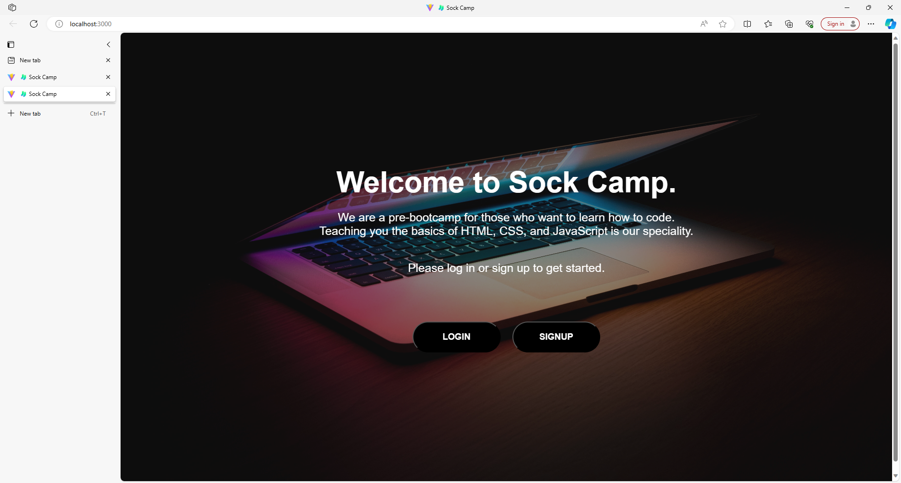
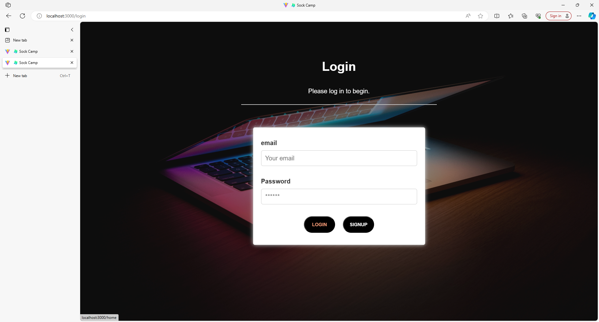
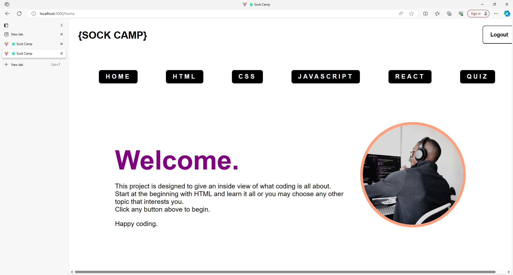
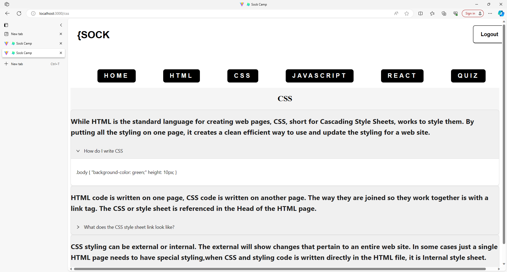

# Bootcamp Final Project -sockCamp
 A pre-BootCamp learning experience  ...because you have to put on your sock before you put on your boot!

# Description

The idea behind sockCamp was to create an application that lets the user get a real look at what Bootcamp is all about. Our goal is to create a bootcamp like experience.  We have started out by offering 4 different topics to explore. Each topic comes with a couple of paragraphs explaining the topic. After reading about the topic, you can click on the bottom text and get a drop-down box that give an example of that code.
In addition, to test your knowledge and see what you have learned at the end we have included a quiz.  This quiz gives random questions from each of the four topics. By participating in sockCamp, the user gets the opportunity to experience what kind of information is taught.  Users spend time working to get a ture, behind the sceens look at Bootcamp. The more the user is prepared and ready, the more that person will learn and succeed in the actual Bootcamp.

## Table of Contents
* [Description](#description)
* [Table of Contents](#table-of-contents)
* [User Story](#user-story)
* [Acceptance Criteria](#acceptance-criteria)
* [Files](#files)
* [Images](#images)
* [Links}(#links)
* [Useage](#usage)
* [Installation](#installation)
* [Credits](#credits)

## User Story

BEFORE signing up for Bootcamp
I want to get an inside look at what it is all about
SO I know if this is something for me to pursue, and if I will like writing code.

## Acceptance Criteria

GIVEN a home page, I have the choice to login or sign up
WHEN I get to the welcome page I am given a description of what sockCamp is about and the topics that I can learn
THEN I can click on the topic of my choice.

WHEN I choose a topic
THEN I am sent to that page
WHERE I will find information on the topic, and what I need to know about it

WHEN I have read about the topic
THEN I have the option to answer questions on that topic to test my knowledge

WHEN I have gone through the topics I will also have the choice of a 5th topic, the Combo
WHEN clicking on the "Combo" button
THEN I will be taken to a page that offers a quiz combining random questions from all four of the previous topics.

## Files

This application uses the following dependencies:
nodemon, mongoose, jsonwebtoken, graphQL, express, bcrypt, apollo/server, node and Ant Design

## Images

## Links
 
 Link to github:  https://github.com/eecmanny/sockCamp
 Link to Heroku: https://rocky-depths-52739-f3f482cf14a1.herokuapp.com/

## Usage

To use this application one must login in or sign up on the Welcome page.  This will give the user access to the pages and topics available.  
From the Welcome page you will be directed to the Home Page, which contains the basic information about the application and the choice of 
which topic you want to go to.  

## Installation

A user must have Heroku installed to run the program. The other way to run it would be through npm i and then an npm run develop to start the application.

## Future deployment: 

Our plans for future development include: adding more information and content to the current topics.  Expanding and adding additional topics. 
Development and expansion of the quiz is also in the plan. We’d like to add a score board to the quiz.  We’d also like the user to be able to view their current 
score and compare it to past scores. It may also be fun to have a score board to be able to view other sockCampers scores. 
As the site grows additional questions, more indepth questions will also need to be added to the quiz.

## Credit: 

Our team is Emmanuel Cordero, Jacob Bassett, Brenny Souza, Linda Vitrella and Ulises Vivar
